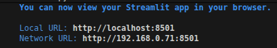

## Como executar este projeto localmente

### 1. Clone o repositório ou baixe

caso escolha clonar o repositório:
```bash
git clone <url-do-repositorio>
cd trabalho_adm_financeira
```

se não baixe o repositório e entre dentro da pasta

### 2. Instale as dependências

certifique-se de ter o python e o pip instalado site de dowload: https://www.python.org/downloads/

```bash
pip install -r requirements.txt
```

### 3. Execute o aplicativo Streamlit
```bash
streamlit run main.py
```

### 4. Coloque seu email

o stramlite vai pedir seu email pode colocar qualquer email que vai, o streamlite vai mostrar no terminal:

apenas entre no link após "Local Url:"